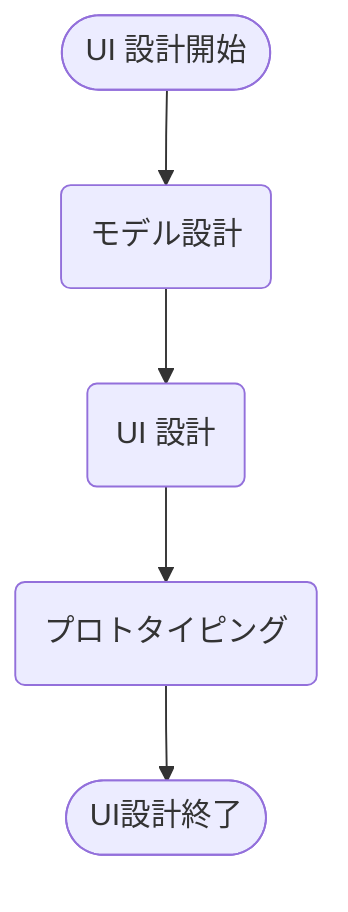
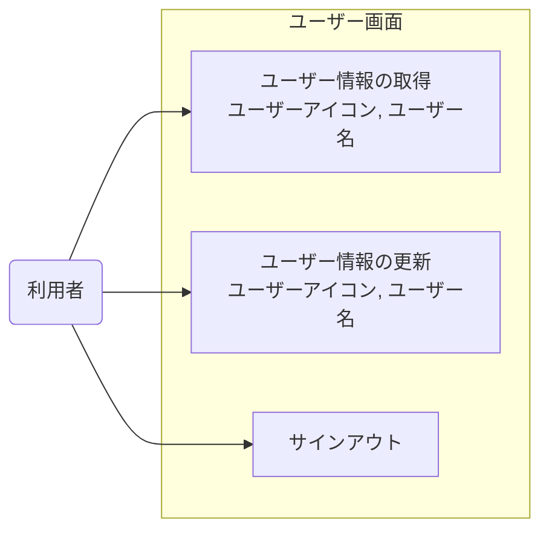
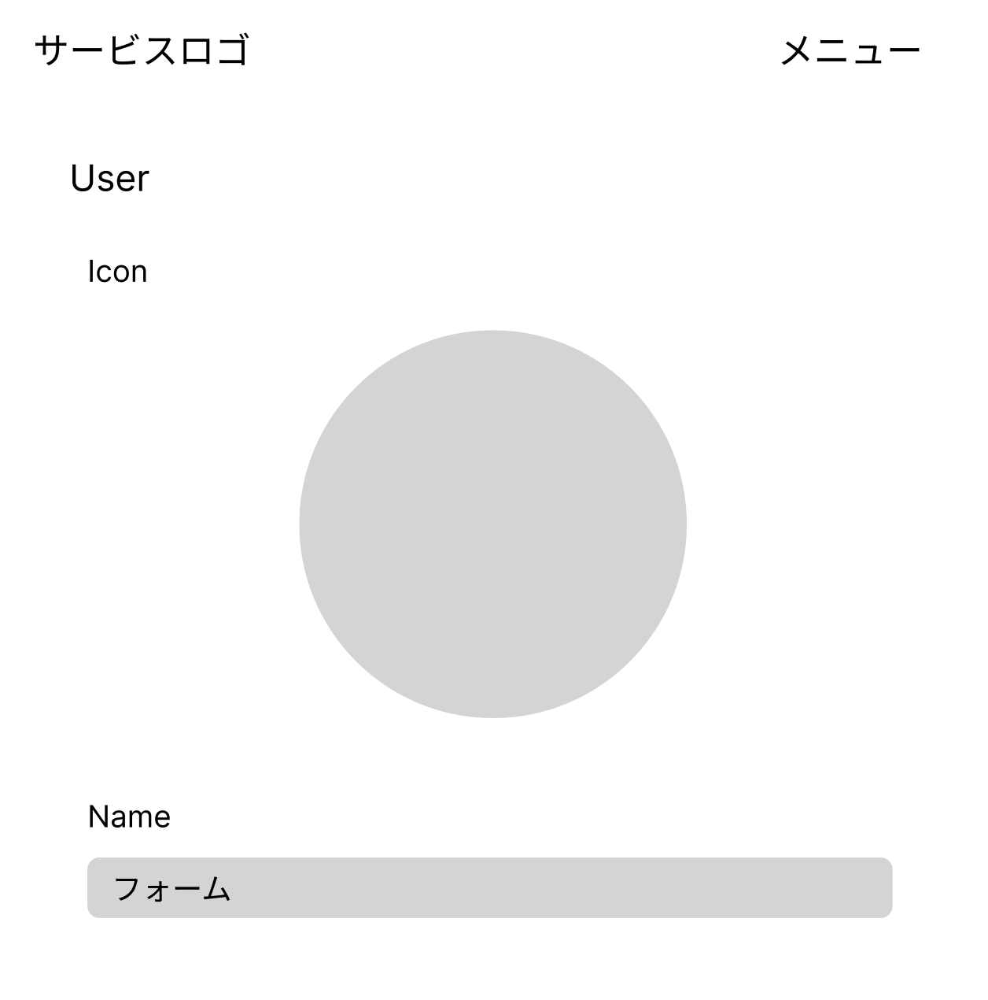
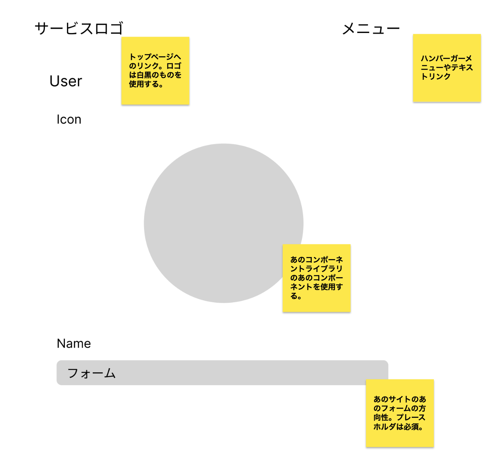

# UI 設計プロセス

自身が UI 設計の際に行うプロセスをまとめる。

## モデル設計（情報設計）

### 目的と期待値

目的：チーム内に対して画面がどんなモデルを扱うかを共有すること。  
アウトプット：ユースケース図  
期待値：画面に対して必要なモデルを把握することで、UI 設計をボトルネックにせずにロジックから開発できている。

### プロセス定義

システムを構成する要素に対して、下記を定義する。

- システムにおいてどんなアクションが行われるか(できるだけ CRUD ベースで記載するとわかりやすい)

下記のようなユースケース図が作成できる。

## UI 設計

### 目的と期待値

目的：モデル設計で定義したユースケース図を UI に落とし込んで、使いやすい UI を作成すること。  
アウトプット：ワイヤーフレームおよびベンチマークを集めたドキュメント  
期待値：作成したシステムがユーザーにとって使いやすいものになっていること（後ろの工程で使いにくい UI を作成してしまうことによる手戻りを防ぐ）。

### プロセス定義

設計したアクションを実現するための UI を、ワイヤーフレームや参考にするベンチマークをもとに考察していく。

#### ワイヤーフレーム

まずは、全体を俯瞰してどのような構成になるか下記のようなワイヤーフレームで共有する。ここではレイアウトを確認しながら、どんなパーツを使用して構成するかをアイデア出ししていく。

#### ベンチマーク

実際に上記のワイヤーフレームを構成するための具体的なパーツを調査していく。「このコンポーネントライブラリのこのパーツが良さそう」など実例をもとにワイヤーフレームにパーツを埋めていく。

## プロトタイピング

### 目的と期待値

目的：実際の使用感が期待通りになっているかを検証する。  
アウトプット：プロトタイプ  
期待値：作成したシステムがユーザーにとって使いやすいものになっていること。

### プロセス定義

作成したワイヤーフレームとベンチマークから実際に触って動かせるプロトタイプを作成する。
Figma などのプロトタイピングツールを使用する方法もあるが、実装者が UI 設計を兼ねる場合はできるだけプロトタイプを流用出来る形で効率化していきたい。
そのため、ここでは Storybook を使用したプロトタイピングを行う（[サンプル](https://github.com/Seyyyy/storybook-proto)）。
